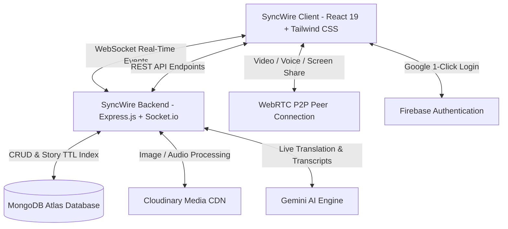

<div align="center">

# ⚡ SyncWire
### *Next-Generation Real-Time Messaging, HD Video Calling & AI Collaboration Platform*

[](https://sync-wire.vercel.app/)
[](https://syncwire.onrender.com/api/status)
[](https://react.dev/)
[](https://nodejs.org/)
[](https://socket.io/)
[](https://www.mongodb.com/)
[](https://webrtc.org/)
[](https://cloudinary.com/)

---

### 🌐 Live Production Links

| Service | Environment | Live URL | Status |
| :--- | :--- | :--- | :--- |
| **Frontend Web App** | Vercel Edge CDN | [**https://sync-wire.vercel.app**](https://sync-wire.vercel.app/) |  |
| **Backend API & WebSockets** | Render Cloud | [**https://syncwire.onrender.com**](https://syncwire.onrender.com/api/status) |  |
| **System Health & Metrics** | Render Cloud | [**https://syncwire.onrender.com/api/health**](https://syncwire.onrender.com/api/health) |  |

---

<p align="center">
  <b>SyncWire</b> is a feature-packed, privacy-first communication platform that goes beyond standard messengers like WhatsApp and Telegram. Featuring peer-to-peer HD video calling, live screen sharing, collaborative whiteboarding, neural live translations, self-destructing burner notes, scheduled messages, interactive polls, AI in-chat copilot, and 24-hour stories with custom music soundtracks.
</p>

</div>

---

## 🌟 Flagship Features

### 🚀 1. Next-Gen Messaging & Media
- **💬 Real-Time Instant Messaging**: Low-latency bi-directional messaging powered by Socket.io.
- **👥 Multi-Member Group Channels**: Create public/private groups, manage member rosters, and chat seamlessly.
- **📊 Interactive Native Polls**: Compose multi-option polls with live animated percentage bars, voter counts, and optional anonymous voting.
- **⏰ Scheduled Message Queue**: Schedule messages with presets (*In 30 mins, 2 hours, 12 hours*) or custom datetime picker. Auto-delivered by a background cron dispatcher.
- **🔥 View-Once Burner Messages**: Self-destructing text and media messages that vaporize after a 5-second countdown upon opening.
- **🎙️ Voice Note Transcriber & TL;DR**: Auto-transcribe audio voice notes to readable text with a 1-line bullet summary.
- **🌐 Real-Time Live Translation**: Neural on-the-fly translation in 20+ languages (Spanish, French, German, Hindi, Japanese, Arabic) directly in chat.
- **🤖 `@SyncAI` In-Chat Group Copilot**: Mention `@SyncAI <question>` in any chat to receive instant answers from the AI assistant.
- **⚡ Smart One-Click Quick Replies**: Context-aware AI suggestions above the input bar.
- **🔊 Voice-to-Text Speech Dictation**: Hands-free live microphone typing directly into the message composer.

---

### 📹 2. HD Calling, Screen Sharing & Whiteboard
- **🎥 WebRTC Video & Voice Calls**: Direct peer-to-peer encrypted voice and video calling.
- **🪞 Natural Mirror-Flipped Camera**: Mirror view for selfie camera feed.
- **🔄 Dynamic Layout Switcher**: Toggle between **PIP Overlay**, **Swapped Main View**, and **50/50 Split View**.
- **💻 Desktop Screen Sharing**: Share screen with 1 click during video calls (`getDisplayMedia`).
- **🎨 Live Collaborative Whiteboard**: Open a real-time drawing canvas during calls with multi-color pens, eraser, and clear canvas tools.

---

### ⭕ 3. 24-Hour Stories & Status with Custom Soundtracks
- **📸 Text & Photo Stories**: Share rich gradient text cards or photos that auto-expire after 24 hours.
- **🎵 Music From Anywhere**:
  - 📁 **Device Audio Upload**: Upload any MP3, WAV, AAC, M4A, or OGG file from your computer or phone.
  - 🔗 **Audio Stream URL**: Paste any direct audio link.
  - ✨ **Curated Presets**: Choose from built-in Lo-Fi, Cosmic, and Summer ambient tracks.
- **❤️ Likes & Live Comments Drawer**: Interactive hearts and real-time reply threads on any story.

---

### 🛡️ 4. Advanced Security & Privacy
- **🔐 Secret Chat Vault (4-Digit PIN Lock)**: Lock and hide sensitive conversations from the sidebar behind a custom security PIN.
- **🔑 1-Click Google OAuth & Email Auth**: Instant Firebase authentication with secure JWT tokens.
- **🗑️ Delete for Everyone**: Remove sent messages for all participants in real time.
- **🔒 End-to-End Encrypted Data Architecture**: Secure password hashing (`bcryptjs`) and scoped REST API endpoints.

---

### 🎨 5. Personalization & Glassmorphic Aesthetics
- **🖼️ 12 Curated Chat Wallpapers**:
  - Default Minimal, Dark Doodle, Light Doodle, Cosmic Stars, Cyber Grid, Sakura Floral, Geometric Honeycomb, Midnight Matrix, Sunset Dunes, Mesh Aura, Matte Slate, and Nature Forest.
- **✨ 8 Futuristic Glassmorphic Themes**: Midnight Nebula, Cyberpunk Neon, Emerald Glow, Royal Amethyst, Sunset Coral, Deep Slate, Arctic Frost, Rose Quartz.
- **🔠 Global Typography Scaling**: Dynamically scale font size across the entire application (*Small, Medium, Large, Extra Large*).
- **🏷️ Contact Nicknames**: Assign custom local aliases to your contacts.

---

## 🏗️ Architecture & Technology Stack



---

## 📁 Repository Structure

```
QuickChat-Full-Stack/
├── client/                      # React 19 Frontend Application
│   ├── src/
│   │   ├── components/          # Reusable UI Components & Modals
│   │   │   ├── AIAssistantModal.jsx
│   │   │   ├── AudioPlayer.jsx
│   │   │   ├── CallModal.jsx       # Video/Voice Call + Screen Sharing
│   │   │   ├── CallWhiteboard.jsx  # Interactive Call Whiteboard Canvas
│   │   │   ├── ChatContainer.jsx   # Messages, Polls, Translations, Burners
│   │   │   ├── CreateGroupModal.jsx
│   │   │   ├── CreatePollModal.jsx # Interactive Poll Composer
│   │   │   ├── CreateStatusModal.jsx # 24h Story + Custom Music Upload
│   │   │   ├── EmojiPicker.jsx
│   │   │   ├── ErrorBoundary.jsx   # Runtime Crash Recovery
│   │   │   ├── MediaViewer.jsx     # Fullscreen Lightbox
│   │   │   ├── RightSidebar.jsx    # Profile, Media Gallery & Vault Toggle
│   │   │   ├── ScheduleMessageModal.jsx # Message Scheduler
│   │   │   ├── SecretVaultModal.jsx # 4-Digit PIN Lock
│   │   │   ├── Sidebar.jsx         # Chat List, Stories & Filters
│   │   │   ├── StatusViewerModal.jsx # Story Viewer + Music Player
│   │   │   └── ThemeModal.jsx      # Themes & 12 Wallpapers
│   │   ├── context/
│   │   │   ├── AuthContext.jsx     # Google & JWT Authentication
│   │   │   ├── CallContext.jsx     # WebRTC Calling & Screen Sharing
│   │   │   └── ChatContext.jsx     # Real-Time Messages, Polls & Vault
│   │   ├── lib/
│   │   │   ├── firebase.js         # Firebase Auth Config
│   │   │   ├── sounds.js           # Haptic Notification Chimes
│   │   │   ├── speech.js           # Web Speech Dictation
│   │   │   └── utils.js            # Formatters & Helpers
│   │   └── pages/
│   │       ├── HomePage.jsx        # Main Dashboard
│   │       ├── LoginPage.jsx       # 2-Column Showcase Landing Page
│   │       ├── PhoneLoginPage.jsx  # Phone Verification
│   │       └── ProfilePage.jsx     # Profile & Wallpaper Studio
├── server/                      # Node.js Express Backend
│   ├── controllers/
│   │   ├── aiController.js         # Live Translation, Transcribe & @SyncAI
│   │   ├── groupController.js      # Group Management
│   │   ├── messageController.js    # Messages, Polls & Scheduled Queue
│   │   ├── otpController.js        # Phone Verification
│   │   ├── storyController.js      # 24h Stories & Cloudinary Music CDN
│   │   └── userController.js       # Auth, Google Login & Nicknames
│   ├── models/
│   │   ├── Group.js
│   │   ├── Message.js              # Poll, Burner, Scheduled & Translation Schemas
│   │   ├── Otp.js
│   │   ├── Story.js                # Music Track Attachment Schema
│   │   └── User.js
│   ├── routes/
│   │   ├── aiRoutes.js
│   │   ├── groupRoutes.js
│   │   ├── messageRoutes.js
│   │   ├── storyRoutes.js
│   │   └── userRoutes.js
│   ├── lib/
│   │   ├── cloudinary.js
│   │   ├── db.js
│   │   └── scheduledJob.js         # 10-Second Cron Dispatcher
│   └── server.js                   # Express + Socket.io Server
└── README.md
```

---

## ⚡ Quick Start Guide

### Prerequisites
- **Node.js**: v18.0 or higher
- **MongoDB**: MongoDB Atlas database URI
- **Cloudinary Account**: Cloud name, API key, API secret

---

### 1. Clone Repository
```bash
git clone https://github.com/Goutam16-Withcode/SyncWire.git
cd SyncWire
```

### 2. Configure Environment Variables

Create `server/.env`:
```env
PORT=5000
MONGODB_URI=your_mongodb_connection_string
JWT_SECRET=your_jwt_secret_key
CLOUDINARY_CLOUD_NAME=your_cloudinary_cloud_name
CLOUDINARY_API_KEY=your_cloudinary_api_key
CLOUDINARY_API_SECRET=your_cloudinary_api_secret
```

Create `client/.env`:
```env
VITE_BACKEND_URL=http://localhost:5000
VITE_FIREBASE_API_KEY=your_firebase_api_key
VITE_FIREBASE_AUTH_DOMAIN=your_project.firebaseapp.com
VITE_FIREBASE_PROJECT_ID=your_project_id
VITE_FIREBASE_STORAGE_BUCKET=your_project.firebasestorage.app
VITE_FIREBASE_MESSAGING_SENDER_ID=your_sender_id
VITE_FIREBASE_APP_ID=your_app_id
```

### 3. Install & Start

#### Run Backend Server:
```bash
cd server
npm install
npm run server
```

#### Run Frontend Client:
```bash
cd client
npm install
npm run dev
```

Visit `http://localhost:5173` in your browser.

---

## 📜 License
This project is open-source and available under the **MIT License**.
